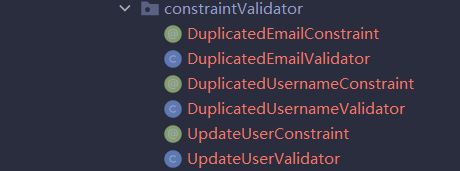

# 后端
## 整体设计

技术实现：基于springboot实现SSMP的整合

**Dao层**：

- XXXDao：继承BaseMapper，进行基本CRUD
- XXXRepository：调用XXXDao的方法，对进行合理的逻辑判断与封装
- XXXReadService：将数据封装为XXXData类型，用于进行数据展示

**数据**

- pojo，与数据库直接相关，从数据库查询后直接封装为实体类
- XXXData：通过XXXReadService创建，用于进行数据展示
- XXXParam：创建或更新时的表单

## 实现的功能

- 注册登录

- 展示文章

- 文章相对应的评论

- 点赞

- 关注

  与关注相关的类，功能今后补充：

  - ArticleQueryService
  - CommentQueryService
  - ProfileData
  - ProfileQueryService
  - 

- 收藏

## 文章

### 实体类
#### Article：

存储信息数据库查询到的信息，并且存在一个tagList通过其他方法填充获得，目前还未写。

通过有参构造函数进行Article的创建

update方法用于进行修改数据从而更新文章数据
#### User：

与Article基本一致

#### Tag：

id+name

传入字符串通过构造函数进行创建

#### ArticleTagRelation

绑定文章和tag

#### ArticleFavorited

用户收藏文章

### Dao层

#### 基础Dao
**ArticleDao**
继承BaseMapper，暂时只用于提供Mybatis-plus的基础CRUD

2022/3/1新增分页查询和按tag统计数量

**ArticleFavoriteDao**、**ArticleTagRelationDao**、**CommentDao**、**TagDao**

只有BaseMapper的基础CRUD

#### Repository
**ArticleRepository/ArticleRepositoryImpl**

**存疑**

传入参数的问题，查询时只提供对应的条件用于查询，删除因为为删除已存在的数据，因此传入一个实体类，但是判断要删除的文章是否存在的逻辑在哪实现？

- save

save用于进行文章的创建或者更新，service层通过构造函数得到文章实体类，传递给save，save分流进行创建或者更新

- createNew

  调用dao的insert进行文章的创建，通过给实体类Article的TagList补充信息

  补充TagList的功能暂时未实现

- findById

  查询后返回optional

- findByslug

  查询后返回optional

- remove

  直接调用dao层的deleteById
  
- findTag

  按名称查询tag，返回Tag实体类

- getPage分页查询

**UserRepository/UserRepositoryImpl**

- findById
- findByUsername
- findByEmail

**CommentRepository/CommentRepositoryImpl**

- save
- find
  - 通过文章Id和评论id进行查找
- remove

**ArticleFavoriteRepository/ArticleFavoriteRepositoryImpl**

处理喜爱文章的，用户与文章之间的关系

- save
- find
- remove

#### ReadService

**ArticleReadService/ArticleReadServiceImpl**

查询文章与文章作者的信息，将数据封装为ArticleData用于展示

- findbySlug
- findById
- findArticles


注：今后可以通过xml配置文件多表联查来进行优化，硬着头皮用Mybatisplus提供的的API效果不是很好，代码较为复杂

**CommentReadService/CommentReadServiceImpl**

查询评论与评论作者的信息，封装为CommentData用于展示

- findById
- findByArticleId

**UserReadService/UserReadServiceImpl**

除去密码展示用户数据，封装为UserData

- findByUsername
- findById

**ArticleFavoriteReadService/ArticleFavoriteReadServiceImpl**

处理用户和喜爱的文章

功能：是否喜欢，喜欢该文章的用户总数，批量处理喜欢该文章的用户总数，在List中，有哪些是当前用户喜爱的文章

- isUSerfavorie
- articleFavoriteCount
- articlesFavoriteCount
- userFavorites

### Service层

**ArticleCommandService**

进行文章的创建与更新，并且通过Constraint和Validator进行验证

**ArticleQueryService**

- findById

- findBySlug

- findRecentArticles:按条件查询，封装为ArticleDataList

- 补充展示信息：

  ```java
  void fillExtraInfo(List<ArticleData> articles,User currentUser);
  
  void fillExtreInfo(String id,User user,ArticleData articleData);
  
  void setFavoriteCount(List<ArticleData> articles);
  
  void setIsfavorite(List<ArticleData> articles,User currentUser);
  ```

**CommentQueryService**

- findById
- findByArticleId

**UserService**

- 自定义验证类

  - 

  

正常情况下用户为一直登录状态，进行信息的修改，但如果没登录，或者查询不到当前用户，TargetUser为null，又因为对Email进行修改，因此null==null则

```java
boolean isEmailValid =
                userRepository.findByEmail(inputEmail)
                        .map(user -> user.equals(targetUser))
                        .orElse(true);

```

此判断的结果为false，被误当成查询到且与targetUser匹配，从而下面的判断有效

```java
if(!isEmailValid){
                context.buildConstraintViolationWithTemplate("email already exist")
                        .addPropertyNode("email")
                        .addConstraintViolation();
            }
```

**UserQueryService**

- findById

**ProfileQueryService**

- findByUsername

**TagsQueryService**

- allTags

### Web层

#### 后续补充的工作

- 用户验证：
  - 相关类：ArticlesApi

 ### Data

#### 表单

- NewArticleParam

  用于创建文章时提交数据，使用hibernate进行认证限制,但是在realworld项目中为何没写@validated注解

  A:@Validated写在service层上

- UpdateArticleParam

  更新文章的表单

#### 数据展示

- ArticleData
  - 传入Article和User进行初始化
  - 内部的profileData通过构造函数传入User进行初始化
- ProfileData
  - 通过User初始化，去除密码和邮箱
- CommentData
  - Comment+User
  - 与ArticleData的设计思想一致
- UserData
  - 传入User，去除密码

### 辅助类assistant

- Mypage

  用于分页查询，对数据进行封装，防止超限

- TimeCursor

  处理DateTime类和字符串的关系，并且规定时间显示的格式

- Util

  内置静态方法用于判断字符串是否合法（不空且不为null）

### 还需继续学习的内容

**自定义表单数据验证**

**异常处理**

**redis**

**拦截器+jwt身份验证**

==拿下==

## 开发日志

### 2022/2/27

完成文章的web，service，dao的三层开发

**当前进度**

已通过测试的方法：

- Dao/repository层
  - testCreateArticle()
  - testselectAll()
  - testFindById()
  - testFindBySlug()
  - testUpdate()
  - testGetPage()
  - testsave（）
  - testInsertRelationship

文章的tag问题尚待解决

service层逻辑暂时还未做完，没对repository的方法进行充分的调用

web层一点没写

**明日工作**

- 补全createNew和Article实体类填充tagList的功能 √
- 完善service层的逻辑  **未完成**
- 研究有关表单认证的注解  **未完成**
- 对表单验证使用非法数据进行测试 **未完成**
- 编写web层**未完成**
- 将service层的分页查询移动到repository中 √
- 总结mybatis-plus使用过程中出现的问题和分页查询的问题至springboot笔记当中 √
- 整理DateTime和其他时间类的使用方法 √

### 2022/2/28

**今日新增的类**

- UserRepository（impl）
- ArticleReadService（impl）
- ArtiFavorited
- ArticleTagRelation
- Tag
- User
- ArticleData
- ProfileData
- TagDao
- UserDao
- ArticleCommandService

**新增功能**

- 对Tag以及ArticleTagrelation进行CRUD
- 创建文章时一并创建tag
- 按tag统计文章数量
- 按slug和id以及ids查询并封装为ArticleData
- 通过Param进行创建和更新文章（已经添加User）
- UserRepository中进行查询封装为optional
- UserDao进行CRUD

**明日工作**

- 完善按条件分页查询：添加tag与作者作为条件 ==已完成==
- 完善service层的逻辑
- 研究有关表单认证的注解 ==后续慢慢学习==
- 对表单验证使用非法数据进行测试 ==已完成==
- 编写web层
- 完善favorited的功能 ==已完成==
- 添加关注的功能 ==暂不考虑==
- 测试UserRepository ==已完成==
- 测试service层的ArticleCommandService ==已完成==

### 2022/3/1

**新增功能**

- 完善了按条件分页查询：添加tag与作者作为条件
- 解决了旧tag无法和新文章绑定的bug

- 编写了类ArticleFavoriteRepository，增加类收藏和取消收藏以及查询的功能
- 编写了CommentRepository类，增加了写评论，按id查评论和删除评论的功能
- UserRepository 按id，姓名，邮箱进行查询
- 编写了CommentData，增加了按文章id，评论id查询后用于展示的功能
- ArticleFavoriteReadService 增加查询是否喜欢文章，该文章被喜欢的数量，多篇文章对应的被喜欢的数量，在当前list中用户喜欢的文章有哪些

- CommentReadService，实现了按文章id，按评论id进行查找，并封装为CommentData类型用于展示
- UserReadService，按用户名，按Id查询用户，封装为UserData

**明日工作**

- 整合Dao层，设计并编写service层 ==已完成==
- 确定dao层的各个函数的调用时机==有待继续总结==
- 看看ArticleReadService中调用Repository是否能替换为调用Dao的基础CRUD来完成（由于要处理tag，大概率不能）==可以更改，但是Tag部分需要重新写一遍，更改的意义不大==

### 2022/3/2

**新增功能**

- 对创建文章时标题的重复性验证的功能
- 修改了ArticleDao中的按条件查询文章Id和统计数量的功能，添加了以favoritedBy作为条件的功能
- 新增ArticleQueryService，Article的service层已经完善
- 新增DuplicatedArticleValidator&DuplicatedArticleConstraint，对文章的重复标题进行限制
- 新增TagsQueryServie，展示所有的Tag
- 新增ProfileQueryService，展示个人资料，关注关系今后再进行补充
- 新增RegisterParam注册表单以及配套的email和Username验证类
- 新增UserService，进行用户的创建和用户信息的修改
- service层搭建完毕

**修复bug**

- 修复了ArticleData忘记初始化tagList的问题
- 修复了ArticleData tagList为空扔对List进行初始化的问题


**明日工作**

- 搭建web层
- 后续补充用户关注的功能

### 2022/3/3

**新增功能**

- 剔除了数据库中的无效数据(虚假作者)
- 新增web层的ArticlesApi，实现按条件查询和模糊查询
- 新增web层的ArticleApi，实现对单篇文章的CRUD
- 新增web层ArticleFavoriteApi，实现喜欢文章或取消喜欢
- 新增web层CommentsApi，实现评论的CRD
- 新增web层ProfileApi，查询个人资料，关注于取关后续进行补充
- 新增web层TagsApi，查询所有的tags

**修复bug**

- 修复了findBySlug请求失败的问题，原因：为了测试而使用的userDao的Bean未进行注入
- 修复了创建文章反序列化失败从而后端拿到的数据全为null的问题，原因：未添加反序列化的注解
- 修复了模糊查询是TagList为空的情况，原因：模糊查询未对tag进行重新查询补充

**明日工作**

- 补全article中的user功能
- 有空增加关注的功能

---

**开始学习序列化认证授权等知识，暂时告一段落**


### 2022/3/7

- 新增异常处理的功能，能够处理的异常：
  - 未经授权的操作，403 FORBIDDEN 
  - 资源未找到，404 NOT_FOUND
  - 空指针异常
  - 表单数据验证未通过异常
  - 其他未知异常
  - 但是在查询不到为空时，无法按照404处理，只能按照空指针处理

### 2022/3/12

- 新增基于Redis和JWT的身份登录验证

尚待解决：

- 修改用户信息时必须填email的问题
- 中文题目生成的slug在路径当中无法解析，增加为中文题目的文章生成英文的slug

### 2022/3/14

- 设置登录时长为7天，7天过后 token过期，redis中自动删除对应的key
- 已扔github

### 2022/3/15

- 解决了中文标题无法生成slug的问题
  - 方案一：将中文转化成拼音，但是无法解决重音的问题
  - 方案二：使用URL编码，但是在传输过程中在后端会被重新解析，因此需要在后端重新编码一次，也较为麻烦，但总体上能解决问题
- 修复了创建文章不添加tag会空指针的问题
- 修复了文章标题查重的问题
- 新增管理员功能，可以删除别人的文章和评论，明日继续添加修改别人个人资料的功能

### 2022/3/17

- 修复了创建新文章时空指针的问题

  创建新文章时会调用自定义校验注解通过slug进行数据校验，而slug的查询结果并未进行空指针校验，从而导致了异常
  
- 新增不登录也可以查看评论，拦截器进行放行，完善token有关的异常信息

- 将token过期时间设置为7天，与redis中一致

- 修改tag：对应的位置：article，ARI，

- 修改slug判断空指针屎山，在repository层进行空指针判断，没有则直接抛出异常

- 请求头token标签换位标准hhtp请求头Authorization

- 清理屎山代码，所有接口初步通过测试

### 2022/3/19

- 新增删除文章是顺带删除文章的tag
- 在service层新增文章时可以添加图片的位置

### 2022/3/21

- 新增FileApi，可在前端上传文件并将访问路径存入数据库中
- FileApi只负责上传文件，在ArticlesApi中接收文件的访问路径并存入数据库当中
- 完善了删除文章时一并删除tag的功能：一并删除tagRelation，但是对于一个tag对应多个文章的问题尚未解决
- 删除文章一并删除数据库中存储的图片访问地址，但是实际图片还未删除

### 2022/3/22

- tag功能全部完善，删除文章时只删除本文章独有的tag，tag对应多个文章时，只有最后一篇文章被删除后，tag才会被删除
- 删除文章时可以一并删除本地文件

尚未完成：

- 将各类路径移至配置文件中，与代码分离
